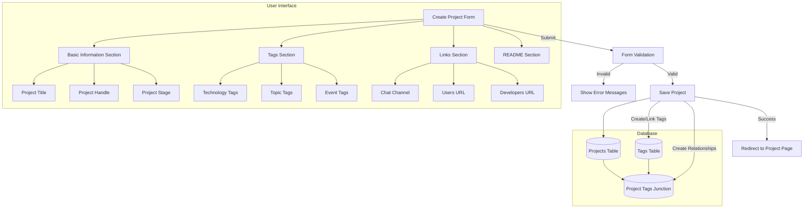
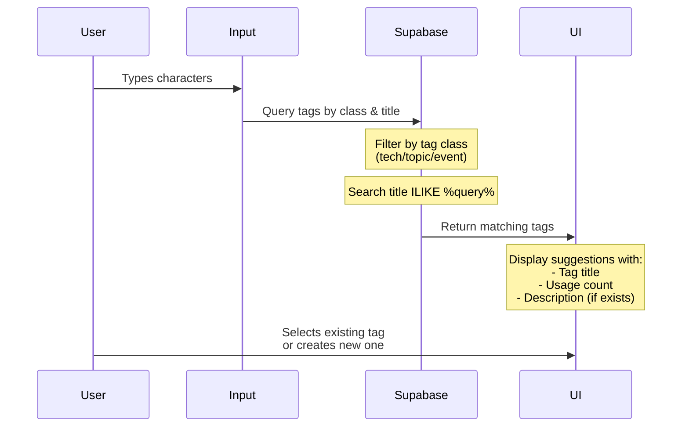
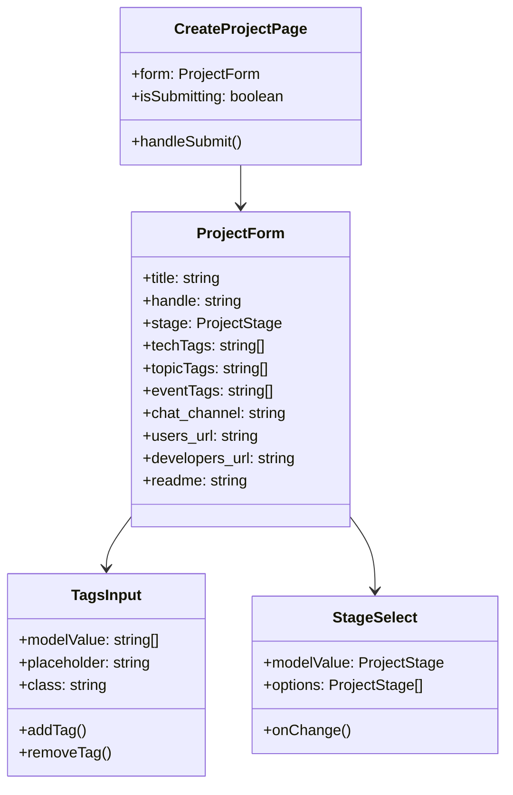

# Create Project Feature PRD

## Overview

The Create Project feature allows users to submit new projects to Code for Philly's project directory. This document outlines the requirements and specifications for the project creation form and its associated functionality.

## Problem Statement

Code for Philly needs a streamlined way for project leaders to submit and manage their civic tech projects. The current process should be formalized through a web interface that ensures consistent project information collection and proper data storage.

## User Stories

1. As a project leader, I want to create a new project so that I can share it with the Code for Philly community
2. As a project leader, I want to add tags to my project so that others can find it based on technologies and topics
3. As a project leader, I want to provide project documentation so that potential contributors can understand the project
4. As a project leader, I want to add relevant links so that others can access project resources

## System Architecture



## Feature Requirements

### Basic Information Section

- Project Title (required)
    - Text input
    - Used to identify the project
- Project Handle (required)
    - Text input with URL preview
    - Used in the project's URL path
    - Format: lowercase letters, numbers, and hyphens only
- Project Stage (required)
    - Dropdown selection
    - Options: Prototyping, Commenting, Testing, Maintaining, Hibernating, Drifting
    - Indicates the current phase of the project

### Project Tags Section

- Technology Tags
    - Multi-select input with free text entry and autocomplete
    - Represents programming languages, frameworks, and tools used
    - Examples from existing tags: JavaScript, Python, React, PostgreSQL, Node.js
    - Blue color theme for visual distinction
    - Autocomplete shows existing tech tags with usage count
- Topic Tags
    - Multi-select input with free text entry and autocomplete
    - Represents project themes and focus areas
    - Examples from existing tags: Civic Engagement, Education, Transportation, Health, Environment
    - Green color theme for visual distinction
    - Autocomplete shows existing topic tags with usage count
- Event Tags
    - Multi-select input with free text entry and autocomplete
    - Associates projects with Code for Philly events
    - Examples from existing tags: Civic Hackathon 2024, Code Sprint 2024
    - Purple color theme for visual distinction
    - Autocomplete shows existing event tags with usage count

### Tag Autocomplete Behavior



### Tag Data Structure

```typescript
interface Tag {
    id: number;
    class: 'tech' | 'topic' | 'event';
    title: string;
    handle: string;
    description?: string;
    items_count: number;
    created_at: string;
}

interface TagSuggestion {
    title: string;
    items_count: number;
    description?: string;
}
```

### Tag Search Implementation

- Query existing tags when user types:
  ```sql
  SELECT title, items_count, description
  FROM tags
  WHERE class = :tagClass
    AND title ILIKE :searchQuery
  ORDER BY items_count DESC, title ASC
  LIMIT 5;
  ```

- Performance considerations:
    - Debounce input to prevent excessive queries
    - Cache recent tag searches
    - Limit to top 5 matches
    - Order by usage count to show most popular tags first

### Tag Creation Rules

- New tags are created if they don't exist
- Tag titles are trimmed and normalized
- Duplicate tags (same title and class) are merged
- Tags maintain a usage count (items_count)
- Tags include optional descriptions
- Tag handles are auto-generated from titles

### Project Links Section

- Chat Channel
    - Optional text input
    - Format: Slack channel name (e.g., #project-name)
- Users URL
    - Optional URL input
    - Links to user-facing project site or documentation
- Developers URL
    - Optional URL input
    - Links to technical documentation or repository

### README Section

- Project README
    - Large text area
    - Supports Markdown formatting
    - Used for project description, goals, and setup instructions

## Technical Specifications

### Database Schema

- Projects table:

  ```sql
  CREATE TABLE projects (
    id UUID PRIMARY KEY DEFAULT uuid_generate_v4(),
    title TEXT NOT NULL,
    handle TEXT NOT NULL UNIQUE,
    stage project_stage NOT NULL,
    chat_channel TEXT,
    users_url TEXT,
    developers_url TEXT,
    readme TEXT,
    created_at TIMESTAMP WITH TIME ZONE NOT NULL
  );
  ```

- Tags table:

  ```sql
  CREATE TABLE tags (
    id UUID PRIMARY KEY DEFAULT uuid_generate_v4(),
    title TEXT NOT NULL,
    class tag_class NOT NULL,
    created_at TIMESTAMP WITH TIME ZONE NOT NULL,
    UNIQUE(title, class)
  );
  ```

- Project-Tags junction table:

  ```sql
  CREATE TABLE project_tags (
    project_id UUID REFERENCES projects(id),
    tag_id UUID REFERENCES tags(id),
    PRIMARY KEY (project_id, tag_id)
  );
  ```

### Component Architecture



### Form Validation

- Required fields must be filled before submission
- Project handle must be URL-safe (lowercase, numbers, hyphens)
- URLs must be valid format
- Tags must be non-empty strings

### Data Flow

1. User submits form
2. Frontend validates input
3. Project record created in database
4. Tags processed:
   - Check for existing tags
   - Create new tags if needed
   - Create project-tag relationships
5. Redirect to new project page on success

## Success Metrics

- Number of projects successfully created
- Tag usage statistics
- Form completion rate
- Average time to complete form
- Error rate during submission

## Future Enhancements

1. Tag suggestions based on existing tags
2. Markdown preview for README
3. Image upload for project screenshots
4. Draft saving functionality
5. Project template selection
6. Bulk tag management
7. Integration with GitHub for repository details

## Implementation Notes

- Use Supabase for database operations
- Implement proper error handling and user feedback
- Ensure responsive design works on all screen sizes
- Add loading states for form submission
- Include proper TypeScript types for form data
- Follow accessibility best practices
